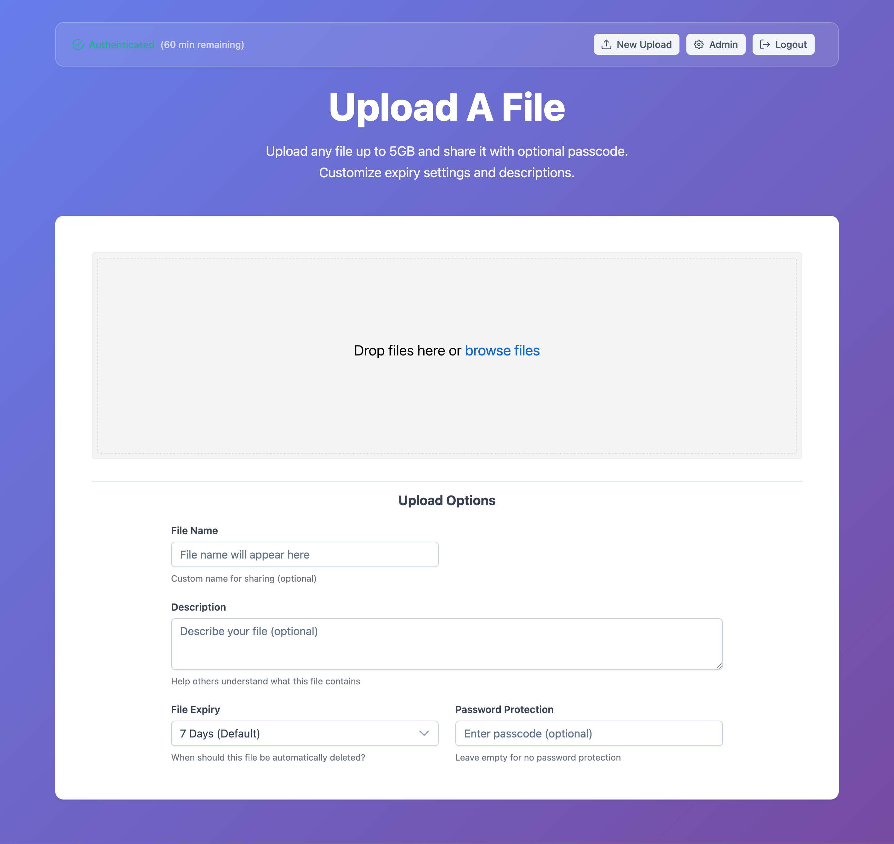
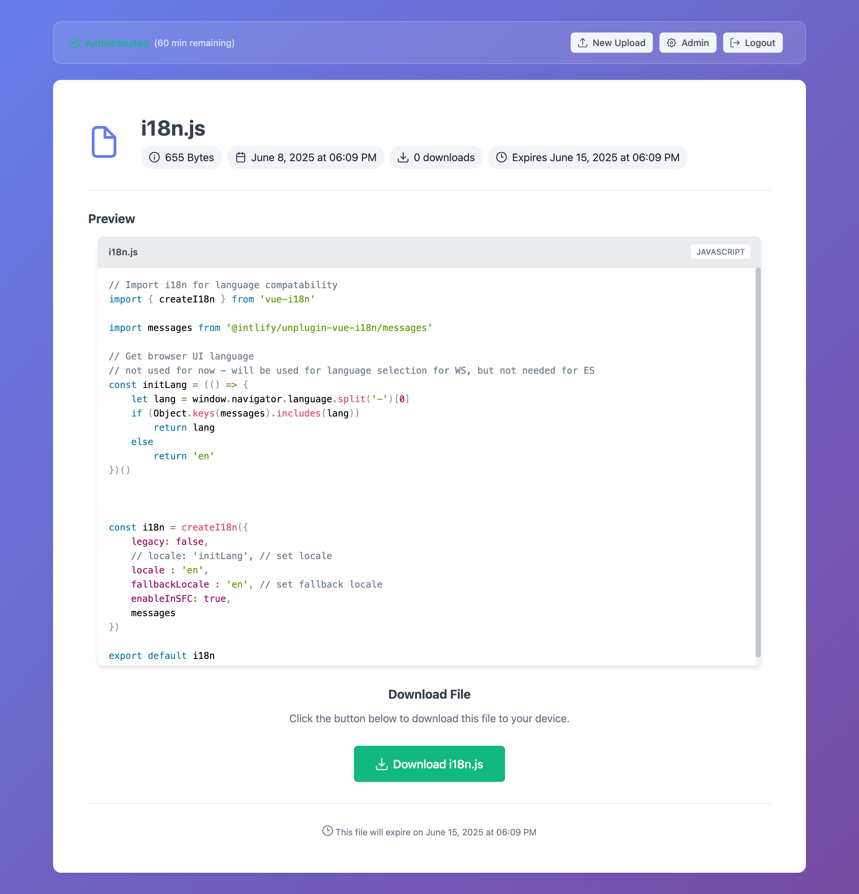
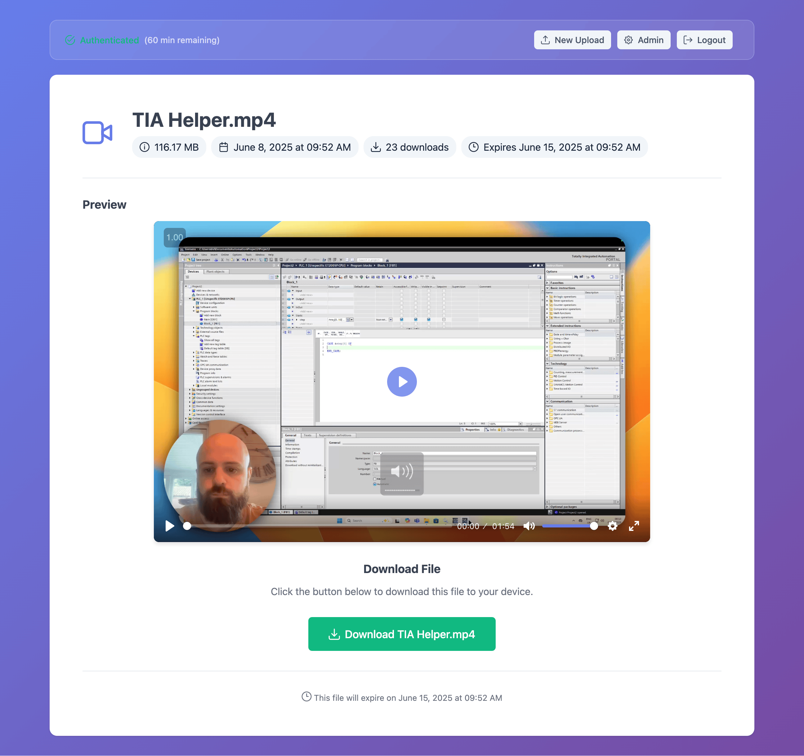
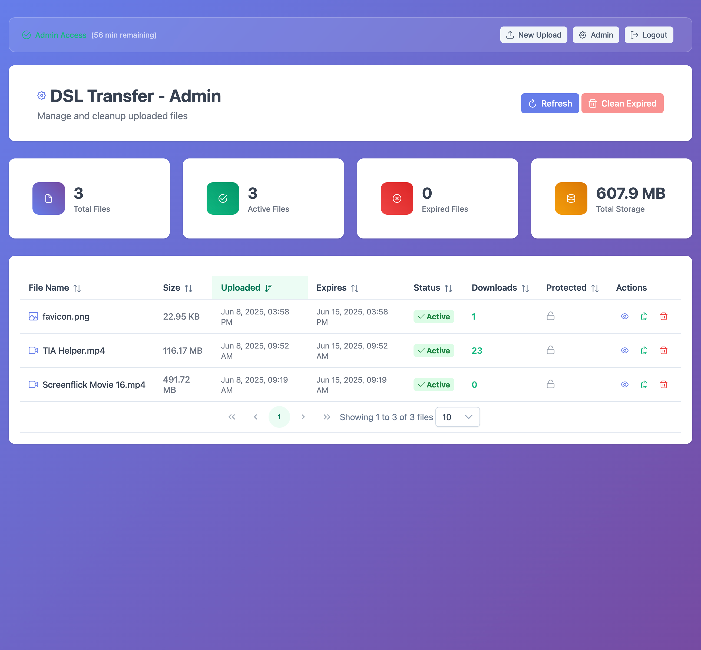

# 🎵 VibeDrop

A beautiful, modern file transfer application that lets you share files up to 5GB securely and magically. Built with Vue 3 and designed for simplicity and elegance.

[](https://cloud.digitalocean.com/apps/new?repo=https://github.com/calumk/VibeDrop/tree/main)

## ✨ Features

- 🚀 **Large File Support** - Upload files up to 5GB with resumable uploads
- 🔒 **Secure Sharing** - Optional passcode protection for files  
- 👀 **Rich Media Preview** - Built-in preview for images, videos, and code files
- ⏰ **Auto Expiry** - Files automatically expire after customizable periods
- 🎨 **Beautiful UI** - Modern glass-morphism design with rainbow effects
- 🛡️ **Authentication System** - Simple password protection and URL-based auth
- 📱 **Responsive Design** - Works perfectly on desktop and mobile
- 🌈 **Syntax Highlighting** - Code preview with Prism.js for 15+ languages
- 🎥 **Video Player** - Professional video playback with Plyr
- 🗂️ **Admin Dashboard** - Manage and cleanup uploaded files

## 📱 Screenshots

### Upload Interface


### Code Preview with Syntax Highlighting  


### Video Preview


### Admin Dashboard


## 🛠 Tech Stack

- **Frontend**: Vue 3 + Vite + Vue Router
- **UI Library**: PrimeVue v4 with Aura theme
- **File Upload**: Uppy.js with multipart S3 integration
- **Media Player**: Plyr for video/audio playback
- **Syntax Highlighting**: Prism.js for code preview
- **Storage**: DigitalOcean Spaces (S3-compatible)
- **Authentication**: Custom auth service with session management
- **Package Manager**: Bun.js or npm

## 🚀 Quick Start

### One-Click Deploy

Deploy to DigitalOcean App Platform with one click:

[](https://cloud.digitalocean.com/apps/new?repo=https://github.com/calumk/VibeDrop/tree/main)

### Local Development

1. **Clone the repository**
```bash
git clone https://github.com/calumk/VibeDrop.git
cd VibeDrop
```

2. **Install dependencies**
```bash
npm install
# or
bun install
```

3. **Configure environment variables**
```bash
cp env.example .env.local
```

Edit `.env.local` with your settings:
```env
VITE_APP_NAME=VibeDrop
VITE_APP_TAGLINE=Share files securely and magically
VITE_FAVICON_URL=https://your-domain.com/favicon.ico
VITE_USE_SIMPLE_LOGIN=false
VITE_ADMIN_PASSWORD=your-secure-password
VITE_SIMPLE_AUTH_STRING=your-secret-auth-string
VITE_S3_ENDPOINT=https://lon1.digitaloceanspaces.com
VITE_S3_REGION=lon1
VITE_S3_BUCKET=your-bucket-name
VITE_S3_ACCESS_KEY_ID=your-access-key
VITE_S3_SECRET_ACCESS_KEY=your-secret-key
```

4. **Start development server**
```bash
npm run dev
# or
bun run dev
```

5. **Build for production (when ready to deploy)**
```bash
npm run build
git add dist/
git commit -m "Update production build"
git push
```

## 🎯 How It Works

### Upload Process
1. User authenticates with admin password or secret URL
2. Select files with optional passcode and expiry settings
3. Files upload directly to S3 with resumable support
4. Metadata stored securely with optional encryption
5. Share generated link instantly

### Sharing & Access
1. Recipients visit shared link (no account needed)
2. Preview supported files (images, videos, code) instantly
3. Password prompt if file is protected
4. Download with progress tracking
5. Files auto-expire based on settings

### File Preview Support

#### Images
- PNG, JPG, GIF, WebP, SVG
- High-resolution preview with zoom

#### Videos  
- MP4, WebM, MOV, AVI
- Professional player with quality selection

#### Code Files
- JavaScript, TypeScript, Python, CSS, HTML
- JSON, YAML, SQL, Bash, and more
- Syntax highlighting with line numbers

## 🔧 Architecture

### Frontend Routes
- `/` - Home/login page with splash or simple login
- `/upload` - File upload interface (protected)
- `/admin` - Admin dashboard for file management (protected)  
- `/:fileId` - Public file view and download

### Components
- `AuthHeader` - Reusable authentication header
- `PreviewVideo` - Video preview with Plyr integration
- `PreviewImage` - Image preview with zoom
- `PreviewText` - Code preview with syntax highlighting

### Services
- `AuthService` - Session management and authentication
- `S3Service` - File operations and metadata handling

## 🔒 Security Features

### Authentication
- **Password Protection**: Admin access with secure sessions
- **URL Authentication**: Secret links for trusted access
- **Session Management**: 1-hour sessions with auto-extension
- **Route Guards**: Protected routes with automatic redirects

### File Security
- **Passcode Protection**: Individual file passwords
- **Signed URLs**: Temporary, secure download links
- **Auto Expiry**: Configurable file lifetimes
- **Admin Controls**: Bulk cleanup and management

## 🎨 UI Features

### Design
- **Glass Morphism**: Modern frosted glass aesthetic
- **Rainbow Effects**: Beautiful hover animations
- **Responsive Layout**: Mobile-first design
- **Dark Theme Ready**: Easily customizable themes

### User Experience
- **Progress Indicators**: Real-time upload feedback
- **Toast Notifications**: Clear user feedback
- **File Type Icons**: Visual file type indicators
- **Drag & Drop**: Intuitive file selection

## 📊 Admin Dashboard

- **File Statistics**: Total files, storage usage, downloads
- **Bulk Operations**: Mass delete expired files
- **File Management**: Individual file actions
- **Expiry Tracking**: Monitor file lifecycles

## 🚀 Deployment Options

### DigitalOcean App Platform (Recommended)
1. Click the deploy button above
2. Configure environment variables
3. Deploy automatically (pre-built static files)

### Manual Deployment
1. Build the project: `npm run build`
2. Upload `dist/` folder to any static hosting
3. Configure environment variables for production

### Supported Platforms
- DigitalOcean App Platform
- Netlify
- Vercel
- GitHub Pages
- Any static hosting service

## 🛠 Configuration

### Environment Variables

All configuration is done through environment variables. See `env.example` for all available options.

**Required:**
- `VITE_S3_*` - DigitalOcean Spaces credentials
- `VITE_ADMIN_PASSWORD` - Admin access password

**Optional:**
- `VITE_APP_NAME` - Custom app branding
- `VITE_FAVICON_URL` - Custom favicon
- `VITE_USE_SIMPLE_LOGIN` - Interface mode toggle

### S3 Setup

1. Create a DigitalOcean Spaces bucket
2. Generate API keys with read/write permissions
3. Configure CORS policy (see `CORS-Setup-Guide.md`)

## 📚 Documentation

- [`DEPLOYMENT.md`](DEPLOYMENT.md) - Detailed deployment guide
- [`CORS-Setup-Guide.md`](CORS-Setup-Guide.md) - S3 CORS configuration
- [`env.example`](env.example) - Environment variable reference

## 🤝 Contributing

1. Fork the repository
2. Create a feature branch: `git checkout -b feature/amazing-feature`
3. Commit changes: `git commit -m 'Add amazing feature'`
4. Push to branch: `git push origin feature/amazing-feature`
5. Open a Pull Request

## ☕ Support the Developer

If VibeDrop has been useful for you, consider supporting the developer:

[](https://ko-fi.com/calumk)

Your support helps maintain and improve VibeDrop! After donating, you can set `VITE_I_HAVE_DONATED_TO_CALUMK=true` in your environment variables to hide the footer attribution.

## 📄 License

This project is licensed under the MIT License - see the [LICENSE](LICENSE) file for details.

## 🙏 Acknowledgments

- **Vue.js** - The progressive JavaScript framework
- **PrimeVue** - Rich set of UI components
- **Uppy** - File upload handling
- **Prism.js** - Syntax highlighting
- **Plyr** - Media player

---

<div align="center">

**Made with ❤️ by [calumk](https://github.com/calumk)**

**Buy me a Coffee ☕ [https://ko-fi.com/calumk](https://ko-fi.com/calumk)**

[](https://cloud.digitalocean.com/apps/new?repo=https://github.com/calumk/VibeDrop/tree/main)

</div> 