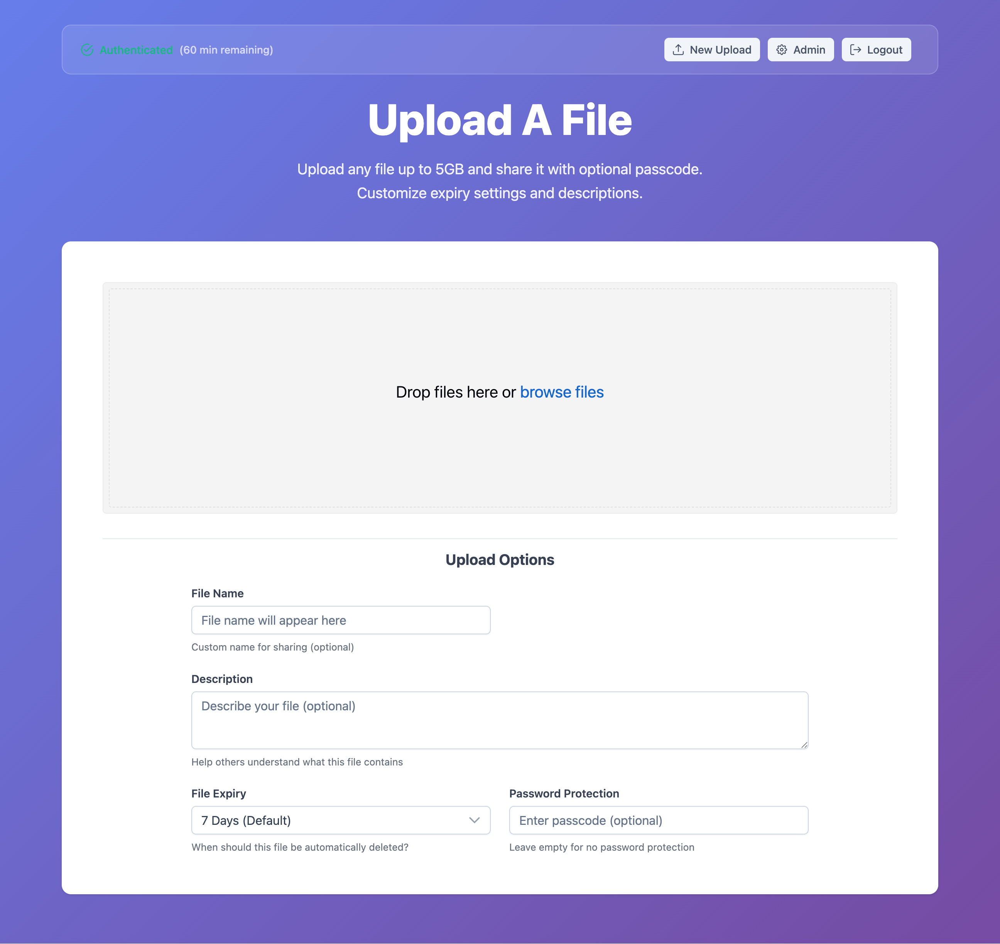
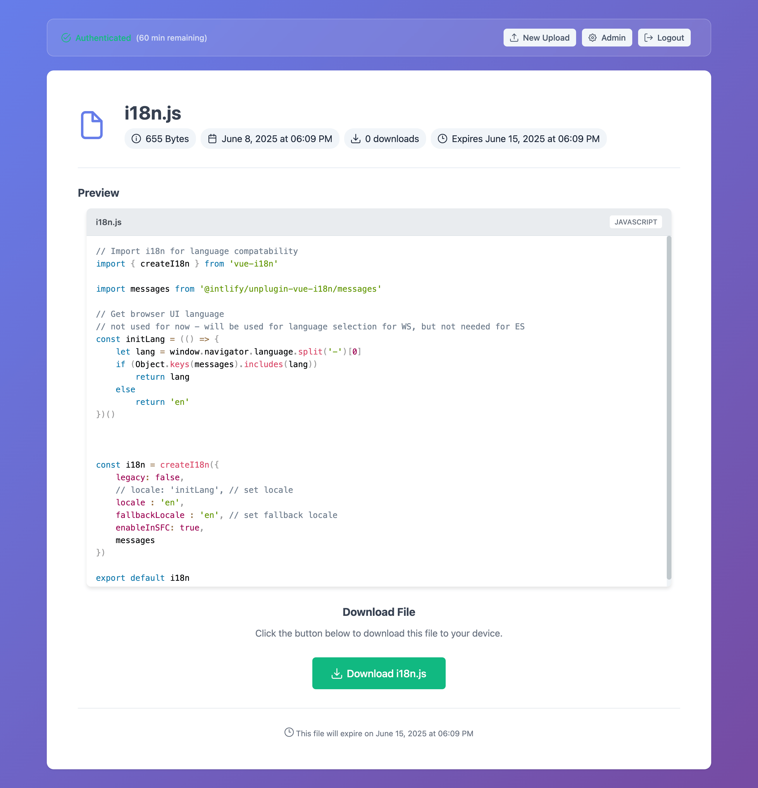

# 🎵 VibeDrop

A beautiful, modern file transfer application that lets you share files up to 5GB securely and magically. Built with Vue 3 and designed for simplicity and elegance.

VibeDrop requires NO database, and can operate either with the provided development server, or using DigitalOcean Functions

[](https://cloud.digitalocean.com/apps/new?repo=https://github.com/calumk/VibeDrop/tree/main)

## ✨ Features

- 🚀 **Large File Support** - Upload files up to 5GB with resumable uploads
- 🔒 **Secure Sharing** - Optional passcode protection for files  
- 👀 **Rich Media Preview** - Built-in preview for images, videos, and code files
- ⏰ **Auto Expiry** - Files automatically expire after customizable periods
- 🎨 **Beautiful UI** - Modern glass-morphism design with rainbow effects
- 🛡️ **Authentication System** - Simple password protection and URL-based auth
- 📱 **Responsive Design** - Works perfectly on desktop and mobile
- 🌈 **Syntax Highlighting** - Code preview with Prism.js for 15+ languages
- 🎥 **Video Player** - Professional video playback with Plyr
- 🗂️ **Admin Dashboard** - Manage and cleanup uploaded files

## 📱 Screenshots

### Upload Interface


### Code Preview with Syntax Highlighting  


### Video Preview


### Admin Dashboard


## 🛠 Tech Stack

- **Frontend**: Vue 3 + Vite + Vue Router
- **UI Library**: PrimeVue v4 with Aura theme
- **File Upload**: Uppy.js with multipart S3 integration
- **Media Player**: Plyr for video/audio playback
- **Syntax Highlighting**: Prism.js for code preview
- **Storage**: DigitalOcean Spaces (S3-compatible)
- **Authentication**: Custom auth service with session management
- **Package Manager**: Bun.js or npm

## 🚀 Quick Start

### One-Click Deploy

Deploy to DigitalOcean App Platform with one click:

[](https://cloud.digitalocean.com/apps/new?repo=https://github.com/calumk/VibeDrop/tree/main)

### Local Development

1. **Clone the repository**
```bash
git clone https://github.com/calumk/VibeDrop.git
cd VibeDrop
```

2. **Install dependencies**
```bash
npm install
# or
bun install
```

3. **Configure environment variables**
```bash
cp env.example .env.local
```

Edit `.env.local` with your settings:

**For Local Development:**
```env
# App Configuration
VITE_APP_NAME=VibeDrop
VITE_APP_TAGLINE=Share files securely and magically
VITE_FAVICON_URL=https://your-domain.com/favicon.ico

# Authentication  
VITE_USE_SIMPLE_LOGIN=false
VITE_ADMIN_PASSWORD=your-secure-password
VITE_SIMPLE_AUTH_STRING=your-secret-auth-string

# DigitalOcean Spaces (for local dev server only)
VITE_S3_ENDPOINT=https://lon1.digitaloceanspaces.com
VITE_S3_REGION=lon1
VITE_S3_BUCKET=your-bucket-name
VITE_S3_ACCESS_KEY_ID=your-access-key
VITE_S3_SECRET_ACCESS_KEY=your-secret-key

# Support the Developer
VITE_I_HAVE_DONATED_TO_CALUMK=false
```

**For Production Deployment:**
In DigitalOcean App Platform, set these as **encrypted environment variables**:
```env
# Frontend Variables (same as above)
VITE_APP_NAME=VibeDrop
VITE_ADMIN_PASSWORD=your-secure-password
# ... other VITE_ variables

# Server-side Function Variables (SECURE - not exposed to client)
S3_ACCESS_KEY_ID=your-access-key
S3_SECRET_ACCESS_KEY=your-secret-key  
S3_ENDPOINT=https://lon1.digitaloceanspaces.com
S3_REGION=lon1
S3_BUCKET=your-bucket-name
```

> **🔒 Security Note**: In production, S3 credentials use non-VITE prefixed variables so they remain server-side only. The VITE_ prefixed versions are only used for local development convenience.

4. **Start development servers**

Start both the frontend and API server together:
```bash
npm run dev
```

This automatically starts:
- **Frontend** at `http://localhost:5173` (Vite dev server)
- **API Server** at `http://localhost:3001` (for secure S3 operations)

You can also run them separately if needed:
```bash
# Terminal 1: API server only
npm run dev:api

# Terminal 2: Frontend only  
npm run dev:frontend
```

5. **Build for production (when ready to deploy)**
```bash
npm run build
git add dist/
git commit -m "Update production build"
git push
```

## 🎯 How It Works

### Upload Process
1. User authenticates with admin password or secret URL
2. Select files with optional passcode and expiry settings
3. Files upload directly to S3 with resumable support
4. Metadata stored securely with optional encryption
5. Share generated link instantly

### Sharing & Access
1. Recipients visit shared link (no account needed)
2. Preview supported files (images, videos, code) instantly
3. Password prompt if file is protected
4. Download with progress tracking
5. Files auto-expire based on settings

### File Preview Support

#### Images
- PNG, JPG, GIF, WebP, SVG
- High-resolution preview with zoom

#### Videos  
- MP4, WebM, MOV, AVI
- Professional player with quality selection

#### Code Files
- JavaScript, TypeScript, Python, CSS, HTML
- JSON, YAML, SQL, Bash, and more
- Syntax highlighting with line numbers

## 🔧 Architecture

VibeDrop uses a **secure serverless architecture** that separates frontend and backend concerns:

### Frontend (Vue 3 SPA)
- `/` - Home/login page with splash or simple login
- `/upload` - File upload interface (protected)
- `/admin` - Admin dashboard for file management (protected)  
- `/file/:fileId` - Public file view and download

### Backend (DigitalOcean Functions)
- **Serverless functions** handle all S3 operations securely
- **Pre-signed URLs** for direct file uploads/downloads  
- **Authentication validation** for protected operations
- **Metadata management** with encryption support

### Components
- `AuthHeader` - Reusable authentication header
- `PreviewVideo` - Video preview with Plyr integration
- `PreviewImage` - Image preview with zoom
- `PreviewText` - Code preview with syntax highlighting

### Services
- `AuthService` - Session management and authentication
- `S3Service` - API client for serverless functions (no direct S3 access)

### Serverless Functions (`/functions/packages/api/`)
- `create-multipart` - Initialize large file uploads
- `sign-part` - Sign individual upload chunks
- `complete-multipart` - Finalize multipart uploads
- `get-upload-url` - Generate secure upload URLs
- `create-metadata` - Store file metadata
- `get-metadata` - Retrieve file information
- `get-download-url` - Generate secure download URLs
- `list-files` - Admin file listing
- `delete-file` - Secure file deletion
- `clean-expired` - Automated cleanup

## 🔒 Security Features

### Authentication
- **Password Protection**: Admin access with secure sessions
- **URL Authentication**: Secret links for trusted access
- **Session Management**: 1-hour sessions with auto-extension
- **Route Guards**: Protected routes with automatic redirects

### File Security
- **Passcode Protection**: Individual file passwords
- **Signed URLs**: Temporary, secure download links
- **Auto Expiry**: Configurable file lifetimes
- **Admin Controls**: Bulk cleanup and management

## 🛡️ Why DigitalOcean Functions Are Essential for Security

VibeDrop uses DigitalOcean Functions (serverless backend) to solve a **critical security vulnerability** that exists in traditional Single Page Applications (SPAs) when dealing with cloud storage.

### 🚨 The Problem: Exposed Credentials in SPAs

In a traditional SPA-only setup, your S3/Spaces credentials would need to be included in the client-side JavaScript bundle:

```javascript
// ❌ DANGEROUS - Credentials exposed to everyone
const s3Client = new S3Client({
  credentials: {
    accessKeyId: "DO00ABC123XYZ789",     // 😱 Visible to all users!
    secretAccessKey: "secret_key_here"   // 😱 Anyone can see this!
  }
})
```

**This means:**
- ✅ Anyone visiting your site can see your S3 credentials in browser dev tools
- ✅ Malicious users can upload unlimited files to your bucket
- ✅ Attackers can delete all your files or rack up huge storage costs
- ✅ No way to control access or implement proper authentication

### ✅ The Solution: Serverless Functions + Pre-signed URLs

VibeDrop's serverless architecture keeps credentials **completely hidden** on the server:

```
┌─────────────────┐    ┌──────────────────┐    ┌─────────────────┐
│   Browser/SPA   │────│ DO Functions    │────│ DigitalOcean    │
│                 │    │ (Server-side)    │    │ Spaces          │
│ • No credentials│────│ • Has credentials│────│ • Secure access │
│ • Makes API calls│   │ • Validates auth │    │ • Pre-signed URLs│
│ • Gets signed URLs│  │ • Generates URLs │    │ • Direct uploads │
└─────────────────┘    └──────────────────┘    └─────────────────┘
```

### 🔐 How It Works Securely

1. **Hidden Credentials**: S3 credentials stay on the server, never sent to browsers
2. **Authentication Validation**: Functions verify user permissions before any S3 operations
3. **Pre-signed URLs**: Temporary, secure URLs for uploads/downloads (1-hour expiry)
4. **Direct Uploads**: Files go straight from browser to S3 (no server bandwidth used)
5. **Audit Trail**: All operations logged and controllable

### 💰 Cost & Performance Benefits

**Minimal Cost:**
- Functions run only when needed (~$0.0001 per upload)
- No always-on server costs
- Free tier covers most personal usage

**Optimal Performance:**
- Files upload directly to S3 (fastest possible)
- No file size limits or server bottlenecks
- Global CDN delivery for downloads

### 🏗️ Architecture Comparison

#### ❌ Insecure SPA-Only Approach
```
Browser ──(with exposed credentials)──► S3 Bucket
   │                                      │
   └─── 😱 Anyone can access ──────────────┘
```

#### ✅ Secure Serverless Approach  
```
Browser ──(API calls)──► Functions ──(secure)──► S3 Bucket
   │                        │                      │
   └─(signed URLs)────────────────────────────────┘
```

### 🚀 Development vs Production

**Local Development:**
- Functions run in Express server at `localhost:3001`
- Uses same code as production
- S3 credentials loaded from `.env.local`

**Production:**
- Functions deploy automatically to DigitalOcean
- Credentials set as encrypted environment variables
- Zero-downtime deployments

### 🔧 What Functions Handle

The serverless functions provide these secure endpoints:

| Function | Purpose | Security Benefit |
|----------|---------|------------------|
| `create-multipart` | Start large file uploads | Validates auth before S3 access |
| `sign-part` | Sign upload chunks | Prevents unauthorized uploads |
| `complete-multipart` | Finish uploads | Ensures proper file completion |
| `get-upload-url` | Generate upload URLs | Pre-signed, time-limited access |
| `create-metadata` | Store file info | Server-side metadata validation |
| `get-metadata` | Retrieve file info | Controlled access to file data |
| `get-download-url` | Generate download URLs | Passcode verification + tracking |
| `list-files` | Admin file listing | Authentication required |
| `delete-file` | Remove files | Admin-only with verification |
| `clean-expired` | Bulk cleanup | Automated maintenance |

### 🛡️ Security Best Practices Implemented

1. **Zero Trust**: No client-side credentials ever
2. **Least Privilege**: Functions have minimal required permissions
3. **Time-limited Access**: All URLs expire automatically
4. **Input Validation**: All parameters sanitized and validated
5. **Error Handling**: No sensitive info leaked in error messages
6. **Audit Logging**: All operations logged for monitoring

**This architecture makes VibeDrop enterprise-ready while remaining simple to deploy and maintain.**

## 🎨 UI Features

### Design
- **Glass Morphism**: Modern frosted glass aesthetic
- **Rainbow Effects**: Beautiful hover animations
- **Responsive Layout**: Mobile-first design
- **Dark Theme Ready**: Easily customizable themes

### User Experience
- **Progress Indicators**: Real-time upload feedback
- **Toast Notifications**: Clear user feedback
- **File Type Icons**: Visual file type indicators
- **Drag & Drop**: Intuitive file selection

## 📊 Admin Dashboard

- **File Statistics**: Total files, storage usage, downloads
- **Bulk Operations**: Mass delete expired files
- **File Management**: Individual file actions
- **Expiry Tracking**: Monitor file lifecycles

## 🚀 Deployment Options

### DigitalOcean App Platform (Recommended)
1. Click the deploy button above
2. Configure environment variables
3. Deploy automatically (pre-built static files)

### Manual Deployment
1. Build the project: `npm run build`
2. Upload `dist/` folder to any static hosting
3. Configure environment variables for production

### Supported Platforms
- DigitalOcean App Platform
- Netlify
- Vercel
- GitHub Pages
- Any static hosting service

## 🛠 Configuration

### Environment Variables

All configuration is done through environment variables. See `env.example` for all available options.

**Required:**
- `VITE_S3_*` - DigitalOcean Spaces credentials
- `VITE_ADMIN_PASSWORD` - Admin access password

**Optional:**
- `VITE_APP_NAME` - Custom app branding
- `VITE_FAVICON_URL` - Custom favicon
- `VITE_USE_SIMPLE_LOGIN` - Interface mode toggle

### S3 Setup

1. Create a DigitalOcean Spaces bucket
2. Generate API keys with read/write permissions
3. Configure CORS policy (see `CORS-Setup-Guide.md`)

## 📚 Documentation

- [`DEPLOYMENT.md`](DEPLOYMENT.md) - Detailed deployment guide
- [`CORS-Setup-Guide.md`](CORS-Setup-Guide.md) - S3 CORS configuration
- [`env.example`](env.example) - Environment variable reference

## 🤝 Contributing

1. Fork the repository
2. Create a feature branch: `git checkout -b feature/amazing-feature`
3. Commit changes: `git commit -m 'Add amazing feature'`
4. Push to branch: `git push origin feature/amazing-feature`
5. Open a Pull Request

## ☕ Support the Developer

If VibeDrop has been useful for you, consider supporting the developer:

[](https://ko-fi.com/calumk)

Your support helps maintain and improve VibeDrop! After donating, you can set `VITE_I_HAVE_DONATED_TO_CALUMK=true` in your environment variables to hide the footer attribution.

## 📄 License

This project is licensed under the MIT License - see the [LICENSE](LICENSE) file for details.

## 🙏 Acknowledgments

- **Vue.js** - The progressive JavaScript framework
- **PrimeVue** - Rich set of UI components
- **Uppy** - File upload handling
- **Prism.js** - Syntax highlighting
- **Plyr** - Media player

---

<div align="center">

**Made with ❤️ by [calumk](https://github.com/calumk)**

**Buy me a Coffee ☕ [https://ko-fi.com/calumk](https://ko-fi.com/calumk)**

[](https://cloud.digitalocean.com/apps/new?repo=https://github.com/calumk/VibeDrop/tree/main)

</div> 